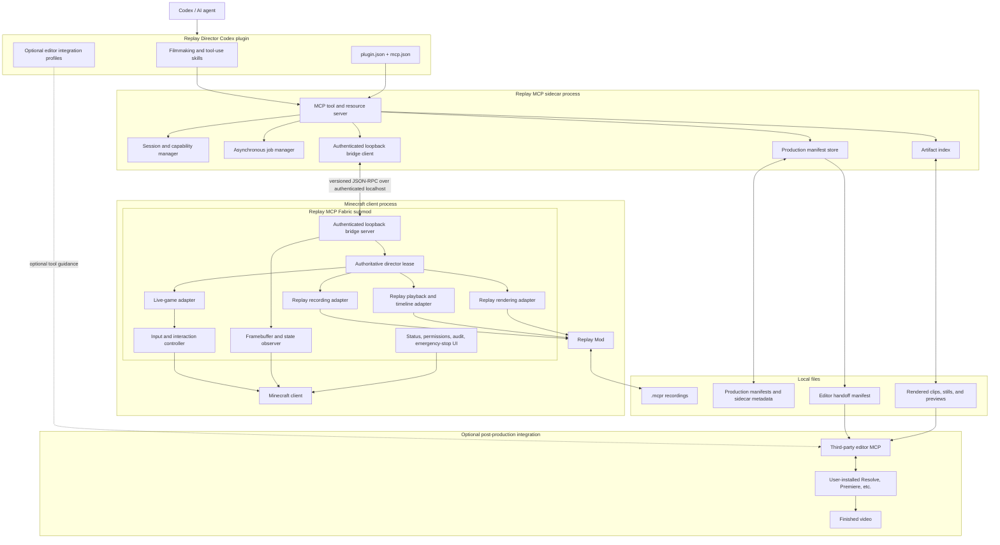
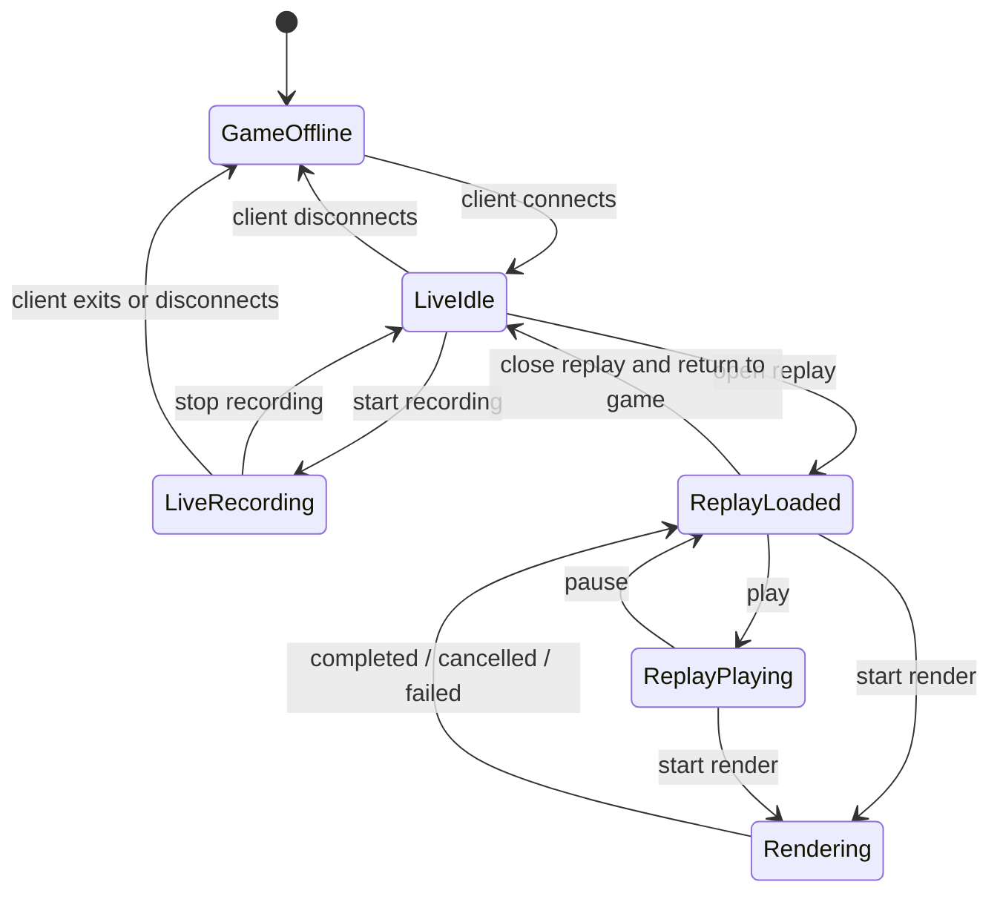
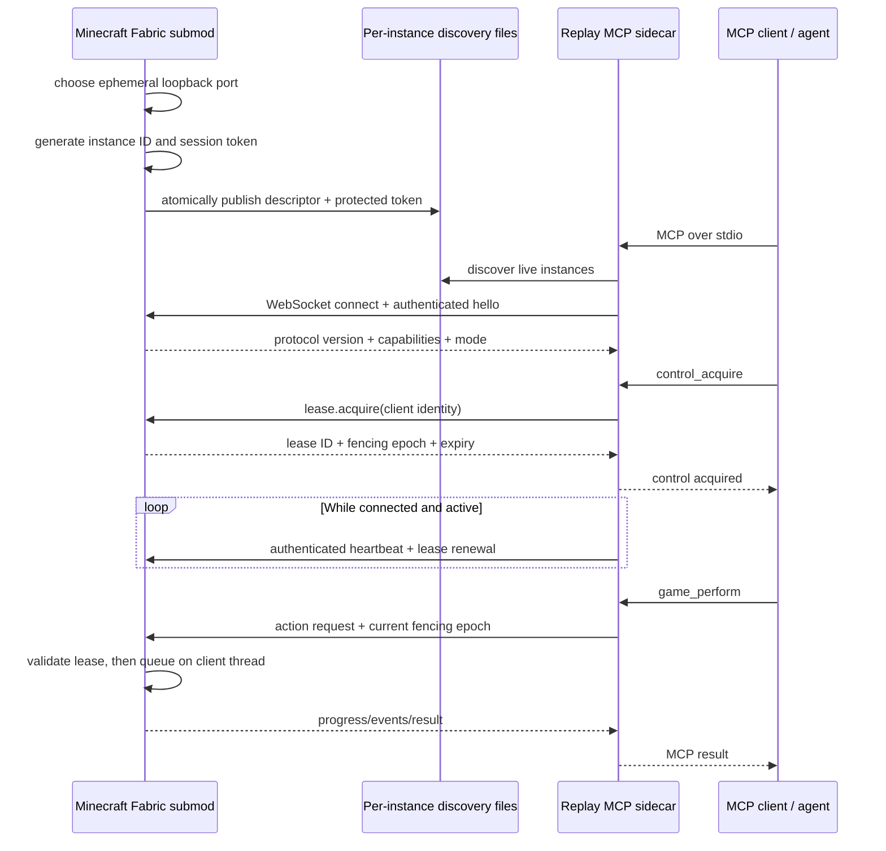
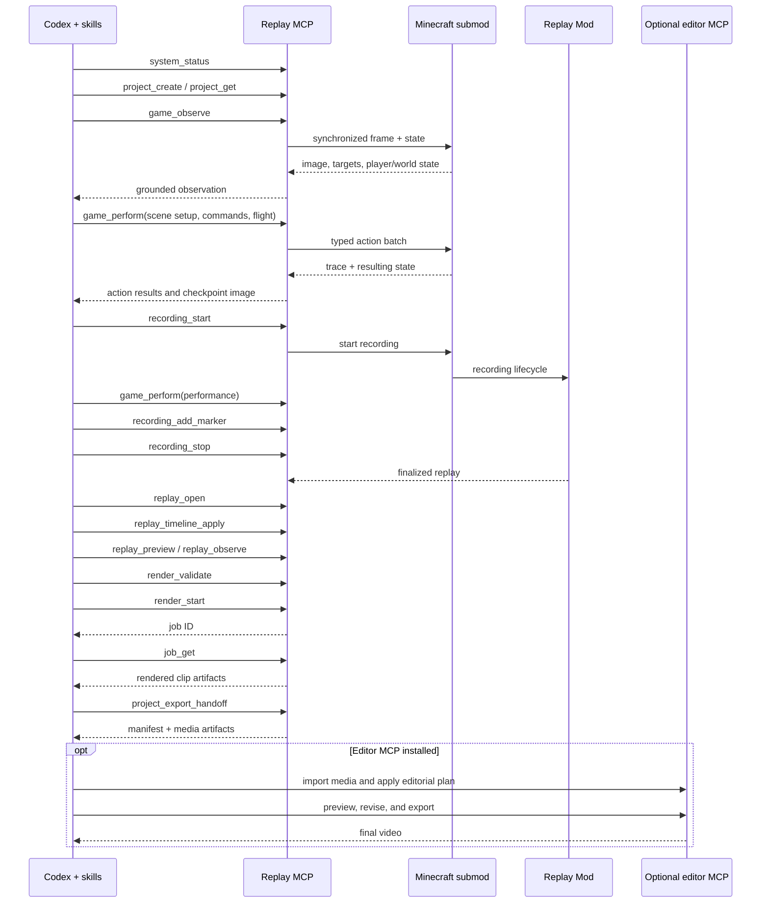

# Replay MCP Architecture and Interface Scope

Status: the Minecraft-side Fabric submod, private bridge, Node sidecar, complete
36-tool public MCP surface, production project store, and minimal Replay
Director plugin are implemented. Automated fake-bridge acceptance passes. The
user-attended graphical Minecraft/Replay Mod/render smoke remains pending, so
the complete real workflow is not yet marked validated. Optional editor
integrations remain future work.

Implementation status in this document describes code coverage, not completed
workflow validation. Unit/contract checks, builds, package validation, and the
fake-bridge MCP workflow have passed; only the live graphical workflow pass is
still pending.

| Scope | Status |
| --- | --- |
| Fabric submod service graph and local human controls | **Implemented** |
| Authenticated mod-to-sidecar bridge and discovery | **Implemented** |
| Minecraft observation and normal-input action primitives | **Implemented** |
| Replay Mod recording, replay, timeline, and render adapters | **Implemented** |
| Public MCP tools, resources, jobs, and bridge client | **Implemented; automated acceptance passed** |
| Production manifests and editor-neutral handoff | **Implemented; automated acceptance passed** |
| Codex plugin and filmmaking workflows | **Minimal workflow implemented, validated, and locally installed** |
| Optional editor MCP profiles/integrations | **Pending / optional** |
| Complete end-to-end workflow acceptance testing | **Automated fake bridge passed; live user-attended smoke pending** |

Replay MCP is a client-side Fabric submod for Replay Mod plus a local MCP
server and a Codex plugin. Together they let an AI agent:

1. observe and operate a live Minecraft client through normal player inputs;
2. record performances with Replay Mod;
3. inspect and edit replay timelines and camera paths;
4. render deterministic Minecraft footage; and
5. hand rendered footage to an optional third-party video-editor MCP.

The current project scaffold targets Minecraft 26.2, Fabric Loader 0.19.5,
Fabric API 0.160.0+26.2, and Replay Mod 26.2-2.6.27. Those versions describe
the current development snapshot, not a permanent compatibility promise.

## 1. Design principles

- **The pixels come from Minecraft.** The agent directs and edits real recorded
  gameplay rather than synthesizing Minecraft-like video.
- **Observe, act, verify.** Visual frames and structured game state are both
  first-class. Neither is sufficient alone.
- **Use normal game paths.** Movement, interaction, flight, chat, and commands
  go through Minecraft's normal client mechanisms so servers and Replay Mod see
  legitimate player activity.
- **Keep workflows out of the wire protocol.** The mod exposes reliable,
  composable primitives. Codex skills describe filmmaking workflows such as
  scene transitions, dialogue coverage, montages, and trailers.
- **Make mutations auditable.** Every action, command, timeline edit, and render
  is associated with a request ID and an action trace.
- **One director at a time.** The mod, as the final authority, grants at most
  one agent an exclusive control lease for a Minecraft instance. Read-only
  observers may coexist, but they cannot move the player or mutate replay
  state.
- **Keep post-production replaceable.** Replay MCP exports footage and an
  editor-neutral handoff manifest. Editor-specific MCPs remain optional sibling
  integrations.
- **Never expose arbitrary JVM execution.** The bridge has a typed protocol and
  a finite capability set. Command execution means Minecraft player commands,
  not shell, Java, script, or server-console execution.

## 2. Complete system architecture



### Why the MCP server is a sidecar

The MCP server is a separate local process rather than an MCP implementation
inside Minecraft. This keeps MCP client lifecycle, standard I/O, schema
validation, artifacts, and long-running jobs independent from the game render
thread. Minecraft can restart without destroying the agent's project manifest,
and the mod does not need to hold Codex's standard-input/output connection.

The sidecar may be implemented in any suitable language. The protocol between
the sidecar and mod is the stable boundary; implementation language is not part
of the public contract.

## 3. Runtime modes and state transitions — Implemented

**Implementation status:** Runtime mode is derived from the active Minecraft
and Replay Mod state in the Fabric submod and projected with persistent
sidecar job/session state.



Rules:

- Live-game controls are unavailable while a replay is the active world.
- Replay editing and rendering are unavailable until a replay is loaded.
- Rendering is represented as an asynchronous job and must never block the MCP
  transport for the duration of an export.
- A disconnect cancels held inputs immediately. Recoverable project, replay,
  render, and audit metadata remain on disk.
- Only the holder of the mod-enforced director lease may invoke state-changing
  game, recording, replay, timeline, or rendering operations. Observations and
  status reads remain shareable.
- Lease loss cancels an active action batch and releases every agent-held input.
  It does not automatically discard a replay or terminate a healthy render.

## 4. Public MCP tool surface

**Implementation status:** All 36 public tools below are registered by the
TypeScript sidecar with Zod inputs, typed error results, structured content,
tool annotations, instance selection, lease enforcement, artifact conversion,
persistent jobs, and project composition. The full surface passes the
in-process MCP/fake-WebSocket acceptance workflow.

The following is the implemented complete public surface. Names are intentionally
domain-prefixed so tool discovery remains understandable when an editor MCP is
also installed.

### 4.1 System, jobs, and artifacts

#### `system_status`

Returns:

- sidecar, bridge-protocol, mod, Minecraft, Fabric, and Replay Mod versions;
- connection and runtime mode;
- negotiated capabilities and feature flags;
- active game, recording, replay, and rendering state;
- configured project and artifact roots;
- security state, including whether commands and flight are enabled; and
- active job summaries.

This is the first tool a skill calls before relying on a capability.

#### `control_status`

Returns the current director-lease state for a Minecraft instance: free or
held, an opaque owner label, acquisition/last-active times, expiry, active
operation, and whether a human override is pending. It never exposes the
holder's authentication secret.

#### `control_acquire`

Requests the exclusive director lease for one Minecraft instance. It returns a
lease ID and expiry information when the instance is free. It returns a typed
`control_busy` conflict when another live owner holds it; it never silently
steals or queues control.

The sidecar renews the lease through authenticated bridge heartbeats while its
MCP session is connected and active. A configured idle ceiling prevents an
abandoned but technically connected process from holding control forever.

#### `control_release`

Releases the caller's director lease. The mod first cancels the caller's active
action batch and releases all held inputs. Releasing control does not stop an
otherwise healthy recording or render; their state remains visible to the next
director.

#### `job_list`

Lists asynchronous render, preview, analysis, and export jobs. Supports status
and project filters.

#### `job_get`

Returns progress, timestamps, logs, warnings, result artifact IDs, and a typed
failure for one job.

#### `job_cancel`

Requests safe cancellation of a cancellable job. Partial outputs are reported
and marked incomplete rather than silently treated as valid artifacts.
Cancelling a job that is running inside Minecraft requires that instance's
director lease; cancelling a sidecar-only job is limited to its owning MCP
session.

#### `artifact_list`

Lists screenshots, motion observations, replay files, preview files, rendered
clips, stills, manifests, and logs. Supports project, scene, shot, take, type,
and creation-time filters.

Binary artifacts are read through MCP resources rather than embedded in every
tool result.

### 4.2 Live-game observation

#### `game_observe`

Captures a visual and structured observation of the current client.

Inputs:

- `view`: `player`, `clean`, or `annotated`;
- `include`: requested state sections;
- image size, downscale, and quality limits;
- nearby-object distance and result limits; and
- whether to persist the frame as an artifact.

Returns:

- an MCP image content block, not merely a local path;
- frame ID, game tick, wall-clock time, and render dimensions;
- camera position, rotation, roll when applicable, and FOV;
- player health, hunger, effects, game mode, abilities, selected item, and
  inventory summary;
- crosshair hit result;
- visible entities with stable observation IDs, names/types, world positions,
  distances, and screen-space bounding boxes;
- selected visible blocks or points of interest;
- current dimension, time, weather, light, and world context; and
- current screen, focused widget, and interactable inventory/UI elements.

`annotated` view overlays the same stable IDs returned in the structured data.
That connects visual reasoning to later `game_perform` targets.

#### `game_observe_motion`

Captures a short visual burst for judging motion that a still image cannot
show: camera easing, walking cadence, particles, combat timing, animation, and
temporal rendering problems.

Inputs include duration or frame count, interval, downscale, quality, and
output mode (`contact_sheet` or `frames`). The result reports dropped frames
and exact capture times.

#### `game_query`

Reads precise structured state without requiring another image.

Query kinds:

- `player`
- `world`
- `entities`
- `blocks`
- `inventory`
- `screen`
- `scoreboard`
- `chat_or_system_messages`
- `target`

Queries support bounds, distance, type, name, tags, stable observation IDs, and
result limits. A query is read-only and must not load arbitrary distant chunks.

### 4.3 Live-game performance

#### `game_perform`

Executes an ordered batch of normal player actions. The batch reduces MCP
round-trips while retaining a trace for every step.

Common batch fields:

- `request_id`: idempotency and audit key;
- `actions`: ordered typed actions;
- `on_failure`: `stop` or `continue`;
- `capture`: `none`, `after`, `checkpoints`, or `after_and_on_failure`; and
- an overall timeout.

Every action may supply a timeout, preconditions, expected postconditions, and
a step label. The result contains start/end ticks, resolved targets, state
changes, server/system messages, observation artifact IDs, and typed errors.

All held keys and buttons are released on completion, cancellation,
disconnect, timeout, or error.

##### Camera actions

| Action | Purpose |
| --- | --- |
| `look` | Set an absolute yaw and pitch over a duration. |
| `turn` | Apply a relative yaw and pitch change. |
| `look_at_position` | Aim at a world coordinate. |
| `look_at_entity` | Aim at an entity or observation ID. |
| `look_at_block` | Aim at a block position and optional face. |

##### Ground and water movement

| Action | Purpose |
| --- | --- |
| `move` | Hold forward/strafe axes for ticks or until a condition. |
| `jump` | Tap or hold jump. |
| `sprint` | Set sprint input for a duration. |
| `sneak` | Set sneak input for a duration. |
| `swim` | Move in water with horizontal and vertical components. |
| `stop_all_inputs` | Immediately release every agent-held input. |

##### Creative and spectator flight

| Action | Purpose |
| --- | --- |
| `set_flying` | Enable or disable flight through normal game controls and verify the result. |
| `fly_move` | Fly with forward, strafe, vertical, sprint, and duration inputs. |
| `fly_to` | Input-driven flight toward a coordinate with tolerance and timeout. |
| `ascend` | Vertical flight convenience action. |
| `descend` | Vertical descent convenience action. |
| `land` | Descend to a safe surface and disable flight when requested. |

Flight requires the current server/game mode to grant the ability. The tool
does not fabricate client abilities or bypass server authority.

##### World interaction

| Action | Purpose |
| --- | --- |
| `attack` | Tap or hold the normal attack input. |
| `use` | Tap, hold, or release the normal use input for either hand. |
| `interact_entity` | Resolve and interact with a specific entity. |
| `break_block` | Aim and hold attack until the block changes or a timeout occurs. |
| `place_or_use_item` | Use the selected item against a resolved target. |
| `swing_hand` | Produce a hand swing without inventing a world mutation. |
| `pick_block` | Use Minecraft's pick-block behavior when available. |

##### Equipment, inventory, and screens

| Action | Purpose |
| --- | --- |
| `select_hotbar_slot` | Select slots 1 through 9. |
| `swap_offhand` | Invoke the normal offhand swap. |
| `drop_item` | Drop one item or the selected stack. |
| `open_inventory` | Open the player inventory. |
| `close_screen` | Close the current handled screen. |
| `click_slot` | Click a structured inventory slot with a declared click type. |
| `click_widget` | Activate a structured widget; coordinates are a fallback, not the primary selector. |
| `type_text` | Type into the focused text field. |
| `submit` | Submit the active screen or text field. |
| `cancel` | Cancel or escape the active screen. |
| `respawn` | Activate the normal respawn control when present. |

##### Vehicles

| Action | Purpose |
| --- | --- |
| `mount` | Interact with a mountable entity. |
| `dismount` | Invoke normal dismount behavior. |
| `vehicle_input` | Apply steering, forward/back, jump, and dismount inputs supported by the vehicle. |

##### Communication and commands

| Action | Purpose |
| --- | --- |
| `send_chat` | Send a normal chat message. |
| `execute_command` | Send an arbitrary player command through Minecraft's normal command path. |

`execute_command` is deliberately not limited to `/tp`. Scene changes on real
servers commonly use plugin commands such as `/home`, `/warp`, `/res tp`, or
`/p tp`. The server remains authoritative and the player cannot exceed their
existing permissions.

Command action metadata includes an intent:

- `scene_transition`
- `scene_setup`
- `in_performance`

The action trace records the literal command subject to configured secret
redaction, the position and dimension before and after it, and resulting
system/chat messages. Configurable deny rules may guard genuinely destructive
commands, but there is no hard-coded vanilla-only allowlist.

##### Timing and verification

| Action | Purpose |
| --- | --- |
| `wait_ticks` | Wait a deterministic number of client ticks. |
| `wait_until` | Wait for a typed game-state condition with a timeout. |
| `checkpoint` | Record state and optionally capture an observation between steps. |

High-level scene transitions are a skill workflow rather than another bridge
primitive: mark out, execute commands, wait for world/chunk stabilization,
fly or walk into place, observe, and mark in.

### 4.4 Replay recording

#### `recording_status`

Returns whether recording is available and active, the current replay/take ID,
start time, duration, file location, markers, warnings, and dropped/error state.

#### `recording_start`

Starts a new Replay Mod recording with project, scene, and take metadata. It
returns a stable take ID and the intended replay artifact ID.

#### `recording_stop`

Stops and finalizes the active recording. It waits only for a bounded handoff;
long finalization becomes a job. The result must distinguish a finalized replay
from a recoverable temporary recording.

#### `recording_add_marker`

Adds a named marker at the current recording tick with a category such as
`action`, `cut`, `transition_out`, `transition_in`, `mistake`, or `note`.

There is no assumption that a scene transition can be removed from the raw
recording. Transition markers tell replay editing and post-production which
interval to exclude.

### 4.5 Replay library and session

#### `replay_list`

Lists available replay recordings with duration, created time, server/world,
project associations, compatibility, recoverability, and metadata summaries.

#### `replay_get`

Returns metadata for one replay, including markers, duration, protocol/version
information, associated takes/shots/renders, and validation warnings.

#### `replay_open`

Loads a replay into Replay Mod and returns an asynchronous job if loading or
cache construction takes more than a short bounded interval.

#### `replay_close`

Closes the active replay safely. Unsaved timeline changes produce a typed
conflict rather than being silently discarded.

#### `replay_save`

Persists Replay Mod path/timeline state and Replay MCP sidecar metadata. An
optional `save_as` target preserves the source replay.

Source recordings should be treated as immutable by default; edits are stored
as named versions or sidecar project data until explicitly saved.

### 4.6 Replay playback, observation, and editing

#### `replay_playback`

Controls the active replay:

- `seek` to replay time;
- `play` and `pause`;
- set preview speed;
- step by tick or frame where supported; and
- select a replay entity to spectate or detach from it.

All times use integer microseconds at the public boundary. Game ticks and frame
numbers may be returned as supplemental metadata but are not the canonical edit
unit.

#### `replay_observe`

Returns the same visual/structured observation concept as `game_observe`, but
for the current replay time and replay camera. It includes replay time, output
timeline time, evaluated camera state, visible replay entities, and active path
segments. Modes are `player`, `clean`, and `annotated`.

#### `replay_timeline_get`

Returns the editable timeline or a requested range, including:

- replay-time mapping;
- camera position/orientation keyframes;
- optional roll, FOV, look-at, and spectate tracks when supported;
- interpolation and easing;
- recording and edit markers;
- named shots and excluded transition ranges; and
- validation warnings such as discontinuities or missing endpoints.

Capability negotiation distinguishes native Replay Mod tracks from additional
Replay MCP sidecar tracks.

#### `replay_timeline_apply`

Atomically applies a batch of timeline operations with a base revision. A stale
base revision produces a conflict instead of overwriting newer work.

Operations include:

- upsert or delete a keyframe;
- move a keyframe;
- set interpolation/easing;
- upsert or delete a marker;
- define, rename, reorder, or remove a shot;
- set a shot's replay in/out and output duration;
- mark a range as excluded or transition footage;
- replace one named track; and
- copy or transform a camera path over a time range.

The response includes the new revision, normalized keyframes, validation
warnings, and an undo token. The MCP never accepts executable expressions as
keyframe data.

#### `replay_preview`

Previews a shot or timeline range and produces either a low-resolution video,
a contact sheet, or sampled frames. It is an asynchronous job for non-trivial
ranges. Previewing is the visual verification step before an expensive render.

### 4.7 Rendering

#### `render_presets`

Lists built-in and user-defined render presets with resolution, frame rate,
codec/container, quality, audio, motion blur, and transparency capabilities.

#### `render_validate`

Performs a read-only preflight for one or more shots:

- replay and camera-path validity;
- output path and free space;
- renderer, codec, and FFmpeg availability;
- resolution and frame-rate support;
- missing resources; and
- estimated frame count and output size when possible.

#### `render_start`

Starts one shot, a range, or a batch of project shots. It accepts either a
named preset or explicit supported overrides and always returns a job ID.

Completed jobs register rendered clips and technical metadata as artifacts.
Cancellation and progress use the generic job tools.

#### `render_still`

Renders a high-quality still at an exact timeline time for framing, thumbnail,
or final-quality review. This differs from `replay_observe`, which is optimized
for fast interactive inspection.

### 4.8 Production project and editor handoff — Implemented (sidecar)

The sidecar maintains a small editor-neutral production model:

```text
Project
└── Scene
    └── Take -> Replay recording + marker range
        └── Shot -> replay in/out + camera/timing tracks
            └── Render -> media artifact + technical metadata
```

#### `project_list`

Lists Replay MCP production projects and their current validation/render state.

#### `project_create`

Creates a project manifest with title, target aspect ratios, frame rate,
resolution, output root, and optional creative brief.

#### `project_get`

Returns the full project or selected scenes/shots, including revisions,
replay/render references, editorial intent, continuity notes, and artifact IDs.

#### `project_apply`

Atomically applies revision-checked operations to scenes, takes, shots,
ordering, narration/caption notes, music cues, and post-production intent.

#### `project_validate`

Checks referential integrity, missing replays/renders, conflicting frame rates,
unrendered shots, invalid ranges, discontinuities, and incomplete handoff data.

#### `project_export_handoff`

Produces an editor-neutral manifest containing:

- ordered clips and absolute or safely resolved media paths;
- stable project, scene, shot, take, replay, render, and artifact IDs;
- source replay ranges and rendered-media in/out times;
- frame rate, resolution, pixel aspect, color, audio, and duration metadata;
- markers, captions, narration, music cues, transitions, and title intent;
- provenance back to replay and camera-path revisions; and
- checksums for media identity.

The initial format is versioned Replay MCP JSON. Optional OTIO, EDL, FCP XML,
or editor-native translators can be added later without changing the core
project model.

## 5. MCP resources — Implemented (sidecar)

The mod stages large outputs atomically and returns bounded artifact metadata,
canonical paths, MIME types, dimensions, sizes, and checksums. The sidecar
confines and re-hashes each registered path, indexes it atomically, and serves
it through the templates below.

Tools mutate state or run bounded queries. Larger immutable/read-only content
is exposed as MCP resources:

| Resource pattern | Content |
| --- | --- |
| `replay-mcp://schema/{name}` | Versioned public schemas and enumerations. |
| `replay-mcp://artifact/{id}` | Image, video, replay, manifest, or log artifact. |
| `replay-mcp://project/{id}/manifest` | Current production manifest. |
| `replay-mcp://replay/{id}/metadata` | Replay metadata and compatibility report. |
| `replay-mcp://job/{id}/log` | Complete job log when too large for `job_get`. |
| `replay-mcp://audit/{session_id}` | Read-only action and command audit trace. |

Media resources should support metadata-first inspection so the model does not
accidentally load a full video when a thumbnail or manifest is sufficient.

## 6. Mod-to-sidecar bridge interface — Implemented

**Implementation status:** The authenticated loopback WebSocket server,
versioned JSON-RPC protocol, discovery publication, token authentication,
capability/status negotiation, request correlation, idempotency, deadlines,
cancellation, events, artifact descriptors, and lease enforcement are
implemented in the Fabric submod. The sidecar client implements authenticated
hello, identity/PID validation, correlation, deadlines, cancellation,
rediscovery, event routing, and the public MCP mapping.

This is an internal, versioned, authenticated protocol. It is not exposed to
the network and is not a second public automation API.



### Transport

- The initial cross-platform transport is a WebSocket bound only to an
  ephemeral port on `127.0.0.1`. A later Unix-domain-socket or named-pipe
  transport may carry the same protocol.
- Messages use a versioned JSON-RPC-style envelope. WebSocket is used because
  requests, cancellation, progress, and unsolicited state events are
  bidirectional.
- Authenticate with a high-entropy ephemeral token generated by the mod for
  that Minecraft process.
- Negotiate protocol versions, instance identity, capabilities, and runtime
  mode during `hello` before accepting other requests.
- Reject external interfaces and unauthenticated requests.
- Use request IDs for correlation and idempotency.
- Stream events for progress; do not poll the render thread aggressively.

The sidecar still exposes ordinary MCP over standard input/output to Codex. The
WebSocket is private plumbing between the sidecar and the mod; it is not the
MCP transport presented to the agent.

### Instance discovery

Each running mod instance publishes an atomic descriptor beneath its Minecraft
game directory, conceptually:

```text
<gameDir>/.replay-mcp/instances/<instance-id>/
├── bridge.json
└── token
```

`bridge.json` contains only discovery metadata: instance ID, process ID,
loopback port, creation time, display name, game directory, and protocol/mod/
Minecraft/Replay Mod versions. The separate token file is readable only by the
current operating-system user where the platform supports file permissions.

The sidecar discovers instances in explicitly configured game directories. It
validates the PID and authenticated handshake instead of trusting a discovery
file alone. Stale descriptors are ignored and later cleaned up. If multiple
clients are running, read tools may specify an `instance_id`; mutating tools
also require that instance's director lease.

### Payload flow

- Normal requests, responses, structured observations, progress, and events
  travel as JSON messages.
- A screenshot may use a binary WebSocket payload or an atomically written
  staging artifact. In either case the sidecar validates its declared MIME
  type, dimensions, length, and checksum before returning MCP image content.
- Replays, previews, and rendered videos are never base64-encoded into bridge
  JSON. The mod writes them under an allowed root and returns an artifact
  descriptor; the sidecar registers and serves the artifact as an MCP resource.
- Paths received from the mod are canonicalized and checked against configured
  roots before the sidecar reads them.

### Threading and cancellation

The bridge I/O thread never reads or mutates Minecraft state directly. It
validates and authenticates a request, then schedules work on the Minecraft
client thread or render thread as required. Frame compression, hashing, and
ordinary file I/O run on bounded worker threads. Each scheduled operation has a
deadline and cancellation token.

### Authoritative director lease

The exclusive lease is stored and enforced in the mod, not in a sidecar lock
file. This is necessary because two agents can launch two independent MCP
sidecars against the same Minecraft process.

The lease contains:

- an unguessable lease ID associated with the authenticated bridge client;
- a human-readable owner label for the in-game overlay;
- acquisition, last-active, and expiry times; and
- a monotonically increasing fencing epoch.

Every state-changing bridge request carries the current fencing epoch. After a
lease expires, is released, or is revoked, the mod increments the epoch and
rejects delayed requests from the former owner even if they were already in a
network buffer. This prevents a stale sidecar from resuming control after a new
director has acquired it.

Lease behavior:

- status, observation, queries, job reads, and artifact reads need no lease;
- live actions, commands, recording mutations, replay mode/playback mutations,
  timeline writes, render starts, and cancellation of mod-backed jobs require
  the lease;
- sidecar-only project edits use revision conflicts instead of the Minecraft
  director lease;
- a bounded action in progress keeps its lease alive until it finishes or hits
  its deadline;
- loss of heartbeat, process exit, explicit release, idle expiry, emergency
  stop, or human revocation cancels input and invalidates the lease;
- the MCP API cannot force-acquire or revoke another owner; and
- a human can always revoke control from the in-game overlay.

By default, physical player input while an agent is directing triggers a human
override: the current action stops, all synthetic inputs are released, and the
lease is revoked. A local user setting may change this to warn-only for assisted
operation, but an agent cannot change that setting.

### Bridge command families

- `system.*`: hello, capabilities, status, health, emergency stop.
- `lease.*`: status, acquire, heartbeat, release, human revoke.
- `observation.*`: framebuffer capture, motion burst, structured snapshot,
  targeted query.
- `action.*`: validate, start batch, cancel batch, release inputs.
- `recording.*`: status, start, stop, marker.
- `replay.*`: list, metadata, open, close, save, playback.
- `timeline.*`: get, validate, apply, undo.
- `render.*`: presets, preflight, start, still, cancel.

### Bridge events

- `connection.changed`
- `lease.changed`
- `mode.changed`
- `screen.changed`
- `action.progress`
- `action.completed`
- `recording.changed`
- `replay.changed`
- `timeline.changed`
- `render.progress`
- `render.completed`
- `render.failed`
- `emergency_stop`
- `error`

Game and render-thread operations are queued onto the correct Minecraft thread.
Framebuffer copying occurs on the render thread; compression and artifact I/O
occur off-thread.

## 7. Fabric submod internal interfaces — Implemented

**Implementation status:** These responsibilities are implemented in the
Fabric submod service graph. Some responsibilities are consolidated into
shared adapters rather than represented by one Java class per row. Optional
tracks that Replay Mod cannot represent natively are reported as unavailable
and remain sidecar-owned as designed.

These are architectural responsibilities rather than promises about Java class
names.

| Component | Responsibility |
| --- | --- |
| `BridgeServer` | Authenticated local RPC, validation, event publication, protocol negotiation. |
| `DirectorLeaseManager` | Enforces one exclusive director, heartbeat expiry, fencing epochs, and human override. |
| `CapabilityRegistry` | Reports features supported by the installed Minecraft and Replay Mod versions. |
| `ModeCoordinator` | Enforces live, recording, replay, and rendering state transitions. |
| `GameObserver` | Produces synchronized framebuffer and structured state observations. |
| `InputController` | Owns agent-held keys/buttons and guarantees their release. |
| `TargetResolver` | Resolves stable observation IDs, entities, blocks, widgets, and slots. |
| `ActionRunner` | Executes timed batches, conditions, checkpoints, and traces. |
| `CommandExecutor` | Sends player commands and associates responses/state changes with traces. |
| `RecordingAdapter` | Integrates Replay Mod recording lifecycle and markers. |
| `ReplaySessionAdapter` | Opens, closes, seeks, and controls replay playback. |
| `TimelineAdapter` | Reads and applies revisioned camera/time/marker changes. |
| `RenderAdapter` | Preflights and runs Replay Mod renders and stills. |
| `AuditService` | Persists action, command, edit, cancellation, and failure records. |
| `ControlOverlay` | Shows connection, active operation, recording state, permissions, and emergency stop. |

Where Replay Mod lacks a native representation for an optional track or piece
of metadata, Replay MCP stores it in versioned sidecar data and makes that fact
visible through capability and provenance fields.

## 8. Codex plugin package — Minimal workflow implemented

```text
plugins/replay-director/
├── plugin.json
├── mcp.json
├── .codex-plugin/plugin.json
├── .mcp.json
├── bin/replay-mcp-server.mjs
├── protocol/bridge-v1/
└── skills/replay-director-workflow/SKILL.md
```

The initial package intentionally contains one workflow skill: capability and
status checks, projects, exclusive control, observe-act-verify direction,
logical takes, replay editing, preview, rendering, handoff, recovery, and
guaranteed release. More artistic genre skills can grow without changing the
MCP protocol.

The core plugin registers only Replay MCP. An editor profile supplies guidance
and optional configuration for a separately installed editor MCP.

## 9. Optional post-production MCP contract — Pending / optional

Replay MCP does not proxy, vendor, or pretend to implement an editor MCP. The
Codex agent coordinates the two sibling MCPs.

An editor integration is considered usable when it can provide equivalents of:

- inspect or create an editor project;
- import media without duplicating it unexpectedly;
- create and inspect sequences/timelines;
- place, trim, move, and remove clips deterministically;
- create tracks, transitions, markers, titles, and captions;
- manipulate supported audio, color, and effects;
- return a visual preview or rendered frame;
- save with undo/recovery semantics;
- export with progress, cancellation, and output verification; and
- report stable object IDs rather than relying only on UI coordinates.

Before an integration profile is recommended, it must pass checks for:

1. license and redistribution terms;
2. supported editor versions and operating systems;
3. localhost binding and authentication;
4. absence or disabling of arbitrary code execution;
5. project backup, undo, and idempotency behavior;
6. media-path, codec, and frame-rate compatibility;
7. preview and visual-verification support;
8. render progress, cancellation, and result validation; and
9. repeatable smoke tests against a disposable project.

Third-party editor binaries are never bundled. Third-party MCP code is not
bundled by default; users install it separately. If a future distribution does
vendor an MCP, that requires a pinned version, security review, license review,
required notices, and review of transitive dependencies.

## 10. Security and human control — Implemented

**Implementation status:** Local authentication, exclusive fenced control,
physical-input revocation, F10 controls, F12 emergency stop, input release,
command opt-in, path confinement, artifact hashing, configuration protection,
and append-only auditing are implemented in the mod. The sidecar additionally
implements authenticated-instance root confinement, checksum/size
reverification, session-owned leases, typed control failures, atomic project
state, and no automatic reacquisition after lease loss.

- The bridge is local and authenticated.
- The mod grants at most one exclusive director lease per Minecraft instance;
  read-only observers may connect concurrently.
- The in-game overlay has an emergency stop that cancels actions and releases
  all held inputs immediately.
- The agent cannot use a tool to relax its own security configuration.
- Commands use only the logged-in player's permissions; Replay MCP has no
  server-console access.
- Arbitrary shell, Java, Python, and script execution are out of scope.
- File access is restricted to configured project, replay, render, and artifact
  roots, with canonical-path validation.
- Destructive project/replay operations are absent from the initial tool set.
- Every mutation and command is auditable by request, session, project, and
  game tick/replay time.
- Screenshots may expose chat, player names, or server information. Observation
  options include HUD hiding and configured redaction for persisted artifacts.

## 11. End-to-end workflow — Implemented; live validation pending

The Minecraft-side calls and Codex/sidecar workflow below are implemented and
pass an automated authenticated fake-bridge acceptance test. The complete
workflow is not marked live-validated until a user-attended graphical client
completes observation, harmless control, recording/finalization, replay edit,
preview/still, render, artifact registration, and handoff export.



## 12. Scope boundaries

**Implementation status:** The included Minecraft, sidecar, project/provenance,
editor handoff, and minimal Codex workflow scope is implemented. Only the live
graphical acceptance run remains pending as identified above.

Included:

- arbitrary player command execution for scene setup and transitions;
- creative/spectator flight through normal inputs;
- grounded visual plus structured observation;
- live gameplay performance and UI/inventory interaction;
- Replay Mod recording, playback, timeline editing, preview, and rendering;
- project/provenance manifests and editor handoff; and
- optional skills for independently installed editor MCPs.

Not included in the core:

- a Minecraft server-console bridge;
- bypassing server permissions or anti-cheat;
- arbitrary code or shell execution;
- direct silent block/entity mutation outside normal gameplay or commands;
- a bundled proprietary video editor;
- a home-grown general-purpose non-linear editor; or
- generative replacement of Minecraft footage.

Potential later extensions:

- pathfinding-assisted `navigate_to` built above normal inputs;
- multi-client actor coordination;
- voice, lip-sync, and dialogue cue tracks;
- automatic highlight and continuity analysis;
- additional timeline interchange formats;
- editor-specific certified integration packs; and
- remote machines through an explicit, separately secured relay rather than
  exposing the in-game bridge.

## 13. Sidecar implementation, repository layout, and distribution

### 13.1 Implementation decision

Implement the local MCP sidecar in TypeScript on Node.js 20 or later and
publish it as an npm package.

Use:

- ESM TypeScript;
- the current v2 `@modelcontextprotocol/server` package;
- `serveStdio(() => buildServer())` from
  `@modelcontextprotocol/server/stdio` so each connection receives its own
  server instance and the SDK can negotiate supported MCP protocol eras;
- Zod v4 for tool inputs, structured outputs, bridge messages, and persisted
  sidecar data;
- `ws` for the private authenticated WebSocket connection to Minecraft,
  because the bridge token is sent in an HTTP header; and
- npm workspaces and the root `package-lock.json` for reproducible development.

Do not begin new code on the v1 monolithic `@modelcontextprotocol/sdk` package.
Some OpenAI examples still show that import, but the current upstream
TypeScript SDK publishes the server API as `@modelcontextprotocol/server`.

Why Node/TypeScript fits this sidecar:

- the official MCP TypeScript SDK directly supports stdio servers;
- the mod protocol is JSON over WebSocket;
- Zod can define the public MCP schemas and validate the untrusted boundary
  between the sidecar and game;
- npm supplies a straightforward executable package for Codex and other local
  MCP clients; and
- the server contains orchestration, validation, persistence, and file
  handling rather than latency-sensitive rendering code.

The sidecar should not expose Streamable HTTP in the initial release. It is a
same-machine companion to a local Minecraft process, so MCP-over-stdio is the
smallest and safest public transport. The sidecar-to-mod WebSocket remains
private implementation plumbing and is not itself an MCP endpoint.

### 13.2 Repository layout

Keep the implemented Fabric project at the repository root. Moving the Gradle
files and Java sources now would add risk without improving the product
boundary.

```text
Replay MCP/
├── build.gradle                         # existing Fabric mod build
├── gradle.properties
├── settings.gradle
├── src/                                 # existing Fabric integration mod
│   ├── main/
│   ├── client/
│   └── test/
├── protocol/                            # language-neutral bridge contract
│   └── bridge-v1/
│       ├── README.md
│       ├── schemas/
│       └── fixtures/
├── packages/
│   └── mcp-server/                      # publishable TypeScript sidecar
│       ├── package.json
│       ├── tsconfig.json
│       ├── src/
│       │   ├── cli.ts
│       │   ├── server.ts
│       │   ├── config/
│       │   ├── bridge/
│       │   ├── tools/
│       │   ├── resources/
│       │   ├── lease/
│       │   ├── artifacts/
│       │   ├── jobs/
│       │   └── projects/
│       └── test/
├── plugins/
│   └── replay-director/                 # installable Agent/Codex plugin
│       ├── plugin.json
│       ├── mcp.json
│       ├── skills/
│       ├── assets/
│       └── bin/                         # generated release bundle
├── tools/                               # existing smoke/developer utilities
├── package.json                         # private npm workspace root
├── package-lock.json
└── ARCHITECTURE.md
```

The root npm package is private and is never published. Only
`packages/mcp-server` is an npm package. `plugins/replay-director` is a plugin
distribution, not an npm workspace package.

The `protocol/bridge-v1` schemas and fixtures become the language-neutral
contract between the implemented Java bridge and the TypeScript sidecar. The
existing Java validators do not need to be replaced by generated code, but
both Java and TypeScript contract tests must accept the same valid fixtures and
reject the same invalid fixtures. Bridge protocol changes require a new
versioned directory or an explicitly backward-compatible schema change.

### 13.3 Sidecar modules

#### Process entry points

- `cli.ts` parses command-line/configuration options, configures stderr-only
  logging, installs shutdown handlers, and starts stdio MCP serving.
- `server.ts` creates one `McpServer`, declares concise shared instructions,
  and registers all tools and resources.
- Standard output is reserved exclusively for MCP messages. Diagnostics,
  bridge logs, and stack traces go to standard error or a rotating log file.

The npm package exposes a `replay-mcp-server` executable through its `bin`
field. It should also export `buildServer` for tests, without exposing raw
bridge internals as public API.

#### Configuration and discovery

The sidecar resolves Minecraft game directories in this order:

1. repeatable `--game-dir` command-line values;
2. an explicit environment variable intended for development;
3. the sidecar config beneath its supplied data directory; and
4. conservative conventional launcher paths, reported as guesses rather than
   silently trusted.

Custom launcher locations need a one-time `replay-mcp-server configure
--game-dir <path>` operation. When `--data-dir` is omitted, the sidecar uses
the operating system's persistent per-user data directory. This avoids making
plugin startup depend on host-specific variable expansion while keeping state
outside the versioned plugin installation. Bridge
tokens remain in the mod's protected discovery directories and are never
copied into `plugin.json`, `mcp.json`, environment literals, or project files.

The discovery module:

- scans `.replay-mcp/instances/*/bridge.json` under configured game roots;
- validates descriptor schemas;
- rejects stale/nonexistent process IDs;
- reads the protected sibling token;
- connects only to the descriptor's loopback port;
- performs authenticated `system.hello`; and
- verifies instance ID, process ID, and bridge protocol before registering the
  instance as usable.

The MCP process should remain running when Minecraft is offline. `system_status`
then returns a useful offline state and the searched game directories rather
than terminating the server.

#### Bridge client

Maintain one WebSocket client object per connected Minecraft instance. It owns:

- monotonically unique JSON-RPC request IDs;
- pending-response correlation and deadlines;
- notification/event dispatch;
- cancellation;
- reconnect and rediscovery after a game restart;
- negotiated capabilities; and
- a strict state transition from authenticated WebSocket to completed
  `system.hello` before other RPCs are sent.

A disconnect fails pending calls promptly. It must not silently reacquire the
director lease after reconnecting; a new `control_acquire` is required.

#### Lease controller

The sidecar stores the current lease ID and fencing epoch inside the MCP
connection's session state and injects them into all mutating bridge calls. The
model does not need to repeat lease credentials in every public tool call.

After `control_acquire`, the controller sends `lease.heartbeat` at the interval
advertised by the bridge. `active` is true only while an operation is executing
or within the configured recent-activity window. On stdio shutdown,
`control_release`, signal handling, or bridge failure, it cancels active work
and makes a best-effort release. The mod remains the authoritative lease owner
and fencing authority.

The implemented bridge should expose its lease TTL, expected heartbeat
interval, and idle ceiling in `system.hello` or `system.status`. If those fields
are not yet present, add them before treating heartbeat timing as a stable
sidecar contract; do not permanently duplicate the Java defaults in TypeScript.

#### Tool adapters

Implement one typed handler per public MCP tool. Do not expose a public
`bridge_call` escape hatch.

Handlers are responsible for:

- selecting or validating the target Minecraft instance;
- checking negotiated capabilities and runtime mode;
- translating public names and units to bridge methods;
- adding request IDs, deadlines, and current lease fencing data;
- translating bridge errors into stable MCP error results;
- returning both `structuredContent` and concise model-readable text;
- attaching accurate read-only, destructive, and open-world annotations; and
- never claiming success merely because a bridge request was accepted.

`game_observe` is a composed sidecar tool: request a framebuffer artifact and a
structured snapshot, verify the artifact metadata/checksum/path, and return the
image as MCP image content alongside the synchronized structured state.

For artifact-returning tools, the sidecar must canonicalize the returned path,
confirm that it lies under an authenticated instance's allowed roots, verify
the stated size and SHA-256 digest, and only then read it. Replays and videos
remain MCP resources or metadata-first artifacts; they are not placed inline
in ordinary tool results.

#### Sidecar-owned state

The following live in the sidecar's data directory rather than the Minecraft
process:

- production project manifests and revisions;
- editor handoff manifests;
- persistent job summaries and logs;
- artifact indexes and provenance; and
- configured Minecraft game-directory roots.

Use atomic write-then-rename persistence and version every stored document.
Project mutations use optimistic revisions. An interrupted write must leave
the previous valid revision readable.

### 13.4 npm package and release strategy

Use a scoped package name when a stable npm organization or user scope is
chosen, for example `<npm-scope>/replay-mcp-server`. Do not assume that this
placeholder name is available until it is reserved.

The published package should contain only compiled `dist/`, `package.json`,
README, license, and required schemas/assets. It should declare:

- `type: "module"`;
- `engines.node: ">=20"`;
- an executable `bin` entry named `replay-mcp-server`; and
- explicit `files` so tests, source-only fixtures, Gradle output, and Minecraft
  recordings cannot enter the npm tarball.

Before publication, CI should run unit, schema, bridge-contract, MCP protocol,
and package-install smoke tests, followed by `npm pack --dry-run`. Publish with
provenance and immutable versions where the release environment supports it.

Publishing to npm is useful for users of Codex, Claude, Cursor, or another
local MCP client. It is not the only copy used by the Codex plugin:

- direct/manual installations can run an exact npm version with `npx` or a
  normal package installation;
- released plugin archives should contain the exact tested JavaScript bundle
  under `plugins/replay-director/bin/`; and
- the plugin must not run an unpinned `npx ...@latest` on every launch.

Bundling the tested JavaScript artifact makes plugin startup deterministic and
offline-capable after installation. The initial plugin still requires a
`node` executable satisfying the declared engine. Platform-native standalone
executables can be considered later if removing that prerequisite becomes
important.

Keep four versions distinct:

1. Fabric mod version;
2. `replay-mcp.bridge/N` protocol version;
3. npm sidecar semantic version; and
4. plugin semantic version.

A product release records a tested compatibility matrix rather than requiring
all four version numbers to remain identical.

### 13.5 Codex/Agent plugin package

Author a portable plugin at `plugins/replay-director`, with root `plugin.json`,
root `mcp.json`, `skills/`, and `assets/`. Add a
`.codex-plugin/plugin.json` compatibility fallback only when a target Codex
surface used during testing still requires it; do not make the legacy layout
the canonical source.

The release `mcp.json` should launch the bundled sidecar over stdio,
conceptually:

```json
{
  "$schema": "https://agent-plugins.org/schemas/1.0.0/mcp.schema.json",
  "mcpServers": {
    "replay-mcp": {
      "type": "stdio",
      "command": "node",
      "args": ["./bin/replay-mcp-server.mjs"],
      "cwd": "."
    }
  }
}
```

`plugins/replay-director/bin` is generated by the release build from
`packages/mcp-server`; it is not a second source tree. A local marketplace test
must run the bundle step before installing/copying the plugin, because Codex
loads the installed plugin copy rather than the workspace source directory.
The relative launch definition is intentional: both the portable host and the
Codex compatibility loader resolve it from the installed plugin root, without
requiring `${PLUGIN_ROOT}` or `${PLUGIN_DATA}` interpolation.

The plugin and npm package are separate distribution products:

- npm distributes the reusable local MCP server;
- the plugin directory distributes skills, presentation metadata, and a pinned
  tested server bundle; and
- the Fabric JAR is distributed through the normal Minecraft-mod release
  channel and is never embedded into the npm package.

### 13.6 Implementation order

1. Write bridge-v1 schemas and golden fixtures from the implemented Java
   protocol, then run them against Java contract tests.
2. Create the private root npm workspace and `packages/mcp-server` skeleton.
3. Implement discovery, authenticated WebSocket hello, status, error mapping,
   reconnect, and logging.
4. Implement the director-lease controller and test two sidecars against one
   fake and one real mod instance.
5. Implement read-only MCP tools, beginning with `system_status`,
   `game_query`, and `game_observe`.
6. Implement `game_perform` and recording tools, including cancellation and
   idempotency tests.
7. Implement replay/timeline/render tools and asynchronous job events.
8. Implement sidecar-owned project, artifact-index, and handoff persistence.
9. Add MCP Inspector tests, package-install tests, and a real Minecraft
   end-to-end smoke suite.
10. Build `plugins/replay-director`, then add artistic and editor-specific
    skills only after the underlying tool behavior is verified.

### 13.7 Current implementation references

- [OpenAI Docs: Build an MCP server](https://developers.openai.com/plugins/build/mcp-server)
- [OpenAI Docs: Package your plugin](https://developers.openai.com/plugins/build/plugins)
- [MCP TypeScript SDK server package](https://github.com/modelcontextprotocol/typescript-sdk/tree/main/packages/server)
- [Agent Plugins MCP server configuration](https://agent-plugins.org/plugin-authors/mcp-servers)

### 13.8 Verification snapshot (2026-09-18)

Implemented verification:

- TypeScript strict typecheck passes against Node 20+ and MCP server/client v2;
- 13 Vitest tests pass across shared schemas, configuration precedence,
  authenticated WebSocket behavior, competing leases, timeouts, artifact
  confinement/checksums, project revisions/handoffs, plugin equivalence, and
  the full in-process MCP/fake-bridge workflow. This includes launching the
  bundled server through the exact plugin stdio definition, listing all 36
  tools, and calling offline `system_status`;
- 15 JUnit tests pass, including the Java half of the shared valid/invalid
  bridge-fixture contract;
- production TypeScript build and deterministic plugin bundle succeed;
- the compatibility plugin and workflow skill pass their validators;
- `npm pack --dry-run` contains only the declared package files; and
- the repo-local `replay-mcp-local` marketplace installs and enables
  `replay-director` version `0.1.0+codex.20260918160619`; an MCP client starts
  the installed cache copy over stdio, lists all 36 tools, and receives its
  offline status successfully.

Not yet validated:

- a real graphical Minecraft client and framebuffer observation;
- live human override and lease-expiry behavior against the Fabric mod;
- Replay Mod connection teardown/finalization and reopening the produced
  `.mcpr`;
- real Replay Mod preview/still/video output with FFmpeg; and
- visual inspection of the final media and exported handoff.

Those live checks require an available prepared client/world and user
participation at connection/disconnection boundaries. Their absence does not
invalidate the automated fake-bridge suite, but it prevents claiming complete
workflow validation.
